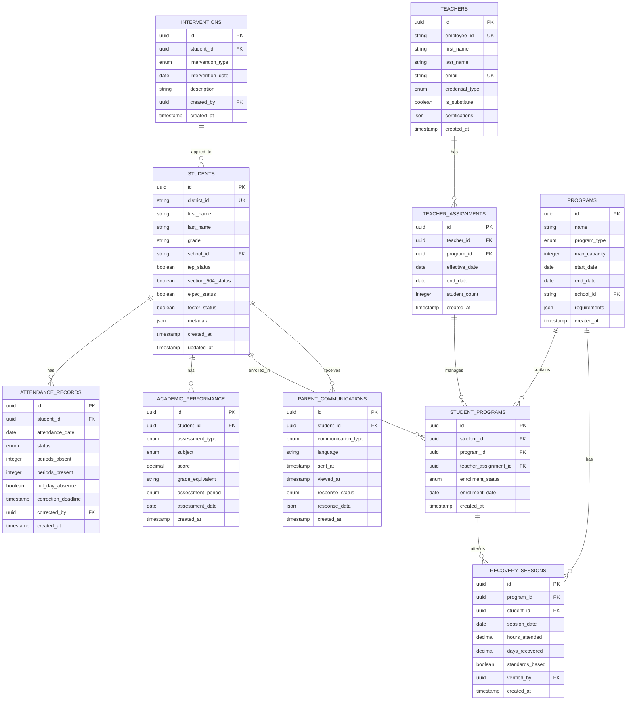

# AP Tool (Romoland) - Comprehensive Architecture Document

## Table of Contents
1. [Executive Summary](#executive-summary)
2. [Requirements Matrix](#requirements-matrix)
3. [User Stories](#user-stories)
4. [System Architecture](#system-architecture)
5. [Database Design](#database-design)
6. [API Structure](#api-structure)
7. [Security Architecture](#security-architecture)
8. [Integration Architecture](#integration-architecture)
9. [User Roles and Permissions](#user-roles-and-permissions)
10. [Performance Requirements](#performance-requirements)
11. [Implementation Phases](#implementation-phases)
12. [DevSecOps Practices](#devsecops-practices)

## Executive Summary

The AP Tool is an attendance recovery platform designed for Assistant Principals at Romoland School District. It addresses California's new attendance recovery legislation (SB 153/176) starting FY 2025-26, positioning the solution as a first-mover in this critical compliance space.

### Key Business Impacts
- **Time Savings**: 6-10 hours weekly per Assistant Principal
- **Financial Recovery**: ~$2M+ in ADA funding annually per district
- **Student Outcomes**: 50% reduction in chronic absenteeism rates
- **Compliance**: Zero audit failures for state requirements

### Technical Stack
- **Frontend**: Next.js 14 (App Router), React 19, TypeScript 5, Tailwind CSS v4
- **Backend**: Supabase (PostgreSQL 15), Prisma ORM
- **Architecture**: Clean Hexagonal Architecture with SOLID principles
- **Testing**: Vitest, Playwright, fast-check, Stryker (>85% coverage)
- **Infrastructure**: AWS Fargate, Terraform, CloudWatch
- **Security**: FERPA-compliant, OWASP ASVS L2

## Requirements Matrix

### Functional Requirements

| ID | Category | Requirement | Priority | Compliance |
|----|----------|-------------|----------|------------|
| FR-001 | Data Integration | Real-time sync with Aeries SIS for attendance data | P0 | SB 153/176 |
| FR-002 | Data Integration | Import i-Ready diagnostic scores (BOY, MOY, EOY) | P1 | - |
| FR-003 | Data Integration | Import School Status Attend (A2A) truancy data | P0 | SB 153/176 |
| FR-004 | Dashboard | Display chronic absentees with attendance percentages | P0 | - |
| FR-005 | Dashboard | Show attendance trends (weekly, monthly, annual) | P0 | - |
| FR-006 | Dashboard | Visualize absences by grade level and day of week | P1 | - |
| FR-007 | Student Management | Rank students by absence percentage | P0 | - |
| FR-008 | Student Management | Apply tiering logic (Tier 1: 1-2 days, Tier 2: 3-9 days, Tier 3: >10%) | P0 | - |
| FR-009 | Student Management | Cross-reference with academic performance | P1 | - |
| FR-010 | Teacher Assignment | Assign students to certificated teachers (20:1 ratio) | P0 | SB 153/176 |
| FR-011 | Teacher Assignment | Track substitute teacher assignments | P1 | - |
| FR-012 | Communication | Generate parent notification letters | P0 | - |
| FR-013 | Communication | Track parent responses (accept/decline) | P1 | - |
| FR-014 | Communication | Multi-language support for letters | P1 | - |
| FR-015 | Compliance | Track recovery sessions (4 hours = 1 day) | P0 | SB 153/176 |
| FR-016 | Compliance | Maximum 10 days recovery per session | P0 | SB 153/176 |
| FR-017 | Compliance | Audit trail for all actions | P0 | FERPA |
| FR-018 | Reporting | Generate state reports (P-1, P-2, Annual) | P0 | SB 153/176 |
| FR-019 | Analytics | Predictive at-risk identification | P2 | - |
| FR-020 | Analytics | Pattern analysis for attendance trends | P2 | - |
| FR-021 | Middle School | Support period-based attendance tracking | P0 | - |
| FR-022 | Data Validation | Handle 7-day attendance correction window | P0 | - |
| FR-023 | Integration | Support IEP, 504, and ELPAC status tracking | P1 | - |
| FR-024 | Workflow | SART/SARB meeting tracking and automation | P2 | - |
| FR-025 | Financial | Calculate ADA recovery projections | P2 | - |

### Non-Functional Requirements

| ID | Category | Requirement | Target | Measurement |
|----|----------|-------------|--------|-------------|
| NFR-001 | Performance | Dashboard load time | <2 seconds | 95th percentile |
| NFR-002 | Performance | Concurrent users support | 50+ APs per district | Load testing |
| NFR-003 | Availability | System uptime during school hours | 99.9% | CloudWatch monitoring |
| NFR-004 | Security | FERPA compliance | 100% | Annual audit |
| NFR-005 | Security | Data encryption at rest and in transit | AES-256, TLS 1.3 | Security scan |
| NFR-006 | Usability | Mobile responsive design | 100% features | Device testing |
| NFR-007 | Scalability | Support 10x current load | Design capacity | Architecture review |
| NFR-008 | Integration | API response time | <500ms | APM monitoring |
| NFR-009 | Compliance | WCAG 2.1 AA accessibility | 100% | Accessibility audit |
| NFR-010 | Data Quality | Validation for all CSV imports | 100% | Unit tests |

## User Stories

### Epic 1: Data Integration and Dashboard

#### US-001: As an AP, I want to see all chronic absentees in one dashboard
**Acceptance Criteria:**
- Dashboard displays all students with >10% absence rate
- Data is pulled automatically from Aeries SIS
- Shows student name, grade, teacher, attendance %, days absent
- Updates in real-time or daily based on data source
- Matches existing "Chronic Absentees - Attendance Overview" spreadsheet format

**Security Considerations:**
- Role-based access control (RBAC) for AP access only
- Audit logging of all data access
- PII encryption in transit and at rest

#### US-002: As an AP, I want to track attendance trends
**Acceptance Criteria:**
- View attendance data by week, month, or year
- Visual charts showing absence percentage trends
- Identify improving vs. declining attendance patterns
- Export capability for reports

**Security Considerations:**
- Data retention policies per FERPA requirements
- Secure export mechanisms with watermarking

#### US-003: As an AP, I want to see academic context for interventions
**Acceptance Criteria:**
- Display i-Ready scores (reading & math) alongside attendance
- Show grade equivalent performance
- Flag students 3+ grade levels behind
- Include IEP, 504, and ELPAC status

**Security Considerations:**
- Separate permission levels for academic vs. attendance data
- Data minimization principles

### Epic 2: Student Prioritization and Assignment

#### US-004: As an AP, I want students automatically ranked for intervention
**Acceptance Criteria:**
- Automatic ranking by absence percentage
- Apply tiering logic (Tier 1-3)
- Filter by grade level, teacher, or intervention need
- Bulk selection capabilities

**Security Considerations:**
- Ensure ranking algorithms don't introduce bias
- Audit trail for all prioritization decisions

#### US-005: As an AP, I want to assign students to recovery programs
**Acceptance Criteria:**
- Select certificated teacher from roster
- Enforce 20:1 student-teacher ratio
- Add substitute teachers manually
- Generate assignment confirmations
- Track program capacity

**Security Considerations:**
- Teacher credential verification
- Assignment history tracking

### Epic 3: Parent Communication

#### US-006: As an AP, I want to automate parent notifications
**Acceptance Criteria:**
- Generate enrollment letters automatically
- Support multiple languages (English, Spanish minimum)
- Track sent/received/responded status
- Include program details and incentives
- Accept/decline functionality

**Security Considerations:**
- Secure delivery mechanisms (encrypted email/portal)
- Parent identity verification
- Communication audit trail

### Epic 4: Compliance and Reporting

#### US-007: As an AP, I want to track attendance recovery sessions
**Acceptance Criteria:**
- Log recovery hours (minimum 1-hour increments)
- Calculate recovered days (4 hours = 1 day)
- Enforce maximum 10 days per session
- Verify standards-based instruction
- Generate compliance reports

**Security Considerations:**
- Tamper-proof audit logs
- Digital signatures for session verification
- Compliance dashboard with alerts

#### US-008: As a District Admin, I want state compliance reports
**Acceptance Criteria:**
- Generate P-1, P-2, and Annual reports
- Match state-required formats
- Include all required data elements
- Automated validation checks
- Export in required formats

**Security Considerations:**
- Report approval workflow
- Version control for submitted reports
- Encrypted transmission to state systems

### Epic 5: Middle School Support

#### US-009: As a Middle School AP, I want period-based attendance tracking
**Acceptance Criteria:**
- Calculate full-day absences from period data
- Handle 7-period schedule
- Account for period-based truancies
- Correct for data entry errors

**Security Considerations:**
- Period-level access controls
- Data validation for scheduling conflicts

## System Architecture

### Clean Hexagonal Architecture

```
┌─────────────────────────────────────────────────────────────┐
│                      Presentation Layer                      │
│  ┌─────────────┐  ┌──────────────┐  ┌──────────────────┐  │
│  │  Next.js    │  │   React 19   │  │  Tailwind CSS    │  │
│  │  App Router │  │  Components  │  │    shadcn-ui     │  │
│  └─────────────┘  └──────────────┘  └──────────────────┘  │
└─────────────────────────────────────────────────────────────┘
                              │
                              ▼
┌─────────────────────────────────────────────────────────────┐
│                     Application Layer                        │
│  ┌──────────────┐  ┌──────────────┐  ┌────────────────┐   │
│  │   Use Cases  │  │   Services   │  │   Validators   │   │
│  │  (Business   │  │ (Orchestrate │  │  (Input/Output │   │
│  │   Logic)     │  │  Use Cases)  │  │   Validation)  │   │
│  └──────────────┘  └──────────────┘  └────────────────┘   │
└─────────────────────────────────────────────────────────────┘
                              │
                              ▼
┌─────────────────────────────────────────────────────────────┐
│                        Domain Layer                          │
│  ┌──────────────┐  ┌──────────────┐  ┌────────────────┐   │
│  │   Entities   │  │    Value     │  │   Domain       │   │
│  │  (Student,   │  │   Objects    │  │   Services     │   │
│  │  Teacher)    │  │ (Attendance) │  │  (Ranking)     │   │
│  └──────────────┘  └──────────────┘  └────────────────┘   │
└─────────────────────────────────────────────────────────────┘
                              │
                              ▼
┌─────────────────────────────────────────────────────────────┐
│                    Infrastructure Layer                      │
│  ┌──────────────┐  ┌──────────────┐  ┌────────────────┐   │
│  │   Supabase   │  │  External    │  │    Logging/    │   │
│  │   Adapters   │  │    APIs      │  │   Monitoring   │   │
│  │  (Prisma)    │  │ (Aeries,etc) │  │  (CloudWatch)  │   │
│  └──────────────┘  └──────────────┘  └────────────────┘   │
└─────────────────────────────────────────────────────────────┘
```

### Component Architecture

```typescript
// Core Domain Entities
interface Student {
  id: string;
  districtId: string;
  firstName: string;
  lastName: string;
  grade: Grade;
  currentAttendanceRate: number;
  academicPerformance: AcademicPerformance;
  specialEducationStatus: SpecialEducationStatus;
}

interface AttendanceRecord {
  studentId: string;
  date: Date;
  status: AttendanceStatus;
  periods?: PeriodAttendance[];
  correctionWindow: CorrectionWindow;
}

interface TeacherAssignment {
  teacherId: string;
  studentIds: string[];
  programId: string;
  effectiveDate: Date;
  ratio: StudentTeacherRatio;
}

// Use Cases
class IdentifyChronicAbsenteesUseCase {
  execute(criteria: AbsenteeCriteria): Student[] {
    // Business logic for identifying chronic absentees
  }
}

class AssignStudentsToTeacherUseCase {
  execute(assignment: AssignmentRequest): TeacherAssignment {
    // Business logic for teacher assignment with ratio validation
  }
}

class GenerateComplianceReportUseCase {
  execute(reportType: ReportType, period: ReportPeriod): ComplianceReport {
    // Business logic for report generation
  }
}
```

## Database Design

### Entity Relationship Diagram



### Data Access Patterns

1. **Dashboard Queries**
   - Get all students with attendance < 90%
   - Join with academic performance for context
   - Include intervention history
   - Filter by grade, school, date range

2. **Real-time Updates**
   - Attendance changes trigger recalculation
   - Update dashboard metrics
   - Check compliance thresholds
   - Generate alerts if needed

3. **Batch Processing**
   - Nightly sync from Aeries
   - Weekly i-Ready data import
   - Monthly A2A truancy data
   - Quarterly compliance reports

## API Structure

### RESTful API Design

```yaml
openapi: 3.0.0
info:
  title: AP Tool API
  version: 1.0.0
  description: Attendance and Performance Tracking API

paths:
  /api/v1/students:
    get:
      summary: List students with filters
      parameters:
        - name: attendance_threshold
          in: query
          schema:
            type: number
        - name: grade
          in: query
          schema:
            type: string
        - name: include_academic
          in: query
          schema:
            type: boolean
      responses:
        200:
          description: List of students
          
  /api/v1/students/{id}/attendance:
    get:
      summary: Get student attendance history
      parameters:
        - name: id
          in: path
          required: true
          schema:
            type: string
        - name: start_date
          in: query
          schema:
            type: string
            format: date
        - name: end_date
          in: query
          schema:
            type: string
            format: date
            
  /api/v1/programs:
    post:
      summary: Create attendance recovery program
      requestBody:
        required: true
        content:
          application/json:
            schema:
              type: object
              properties:
                name:
                  type: string
                capacity:
                  type: integer
                teacher_id:
                  type: string
                  
  /api/v1/assignments:
    post:
      summary: Assign students to teacher
      requestBody:
        required: true
        content:
          application/json:
            schema:
              type: object
              properties:
                teacher_id:
                  type: string
                student_ids:
                  type: array
                  items:
                    type: string
                program_id:
                  type: string
                  
  /api/v1/communications:
    post:
      summary: Send parent notification
      requestBody:
        required: true
        content:
          application/json:
            schema:
              type: object
              properties:
                student_ids:
                  type: array
                  items:
                    type: string
                template_id:
                  type: string
                language:
                  type: string
                  
  /api/v1/reports/{type}:
    post:
      summary: Generate compliance report
      parameters:
        - name: type
          in: path
          required: true
          schema:
            type: string
            enum: [P1, P2, ANNUAL]
```

### API Security

1. **Authentication**: JWT tokens with refresh mechanism
2. **Authorization**: Role-based (Admin, AP, Teacher, Viewer)
3. **Rate Limiting**: 1000 requests/hour per user
4. **Input Validation**: Zod schemas for all endpoints
5. **Output Sanitization**: Remove PII based on permissions

## Security Architecture

### STRIDE Threat Model

#### Spoofing
- **Threat**: Unauthorized user impersonates AP or teacher
- **Mitigation**: 
  - Multi-factor authentication (MFA) required
  - SSO integration with district identity provider
  - Session management with secure tokens

#### Tampering
- **Threat**: Attendance data modified after submission
- **Mitigation**:
  - Audit log with cryptographic signatures
  - Immutable event store for critical changes
  - Version control for all data modifications
  - 7-day correction window enforcement

#### Repudiation
- **Threat**: User denies making changes to student records
- **Mitigation**:
  - Comprehensive audit logging
  - Digital signatures on submissions
  - Timestamp all actions with NTP sync
  - Chain of custody for compliance reports

#### Information Disclosure
- **Threat**: Student PII exposed through breach
- **Mitigation**:
  - Encryption at rest (AES-256)
  - Encryption in transit (TLS 1.3)
  - Field-level encryption for sensitive data
  - Data minimization practices
  - Regular security scans

#### Denial of Service
- **Threat**: System unavailable during critical reporting periods
- **Mitigation**:
  - AWS Auto Scaling groups
  - CloudFront CDN for static assets
  - Rate limiting per user/IP
  - Database connection pooling
  - Circuit breakers for external APIs

#### Elevation of Privilege
- **Threat**: Teacher gains admin access
- **Mitigation**:
  - Principle of least privilege
  - Role-based access control (RBAC)
  - Regular permission audits
  - Segregation of duties

### Data Security Measures

```typescript
// Example security implementation
class SecurityService {
  // Field-level encryption for PII
  encryptPII(data: StudentData): EncryptedStudentData {
    return {
      ...data,
      ssn: this.encrypt(data.ssn),
      birthDate: this.encrypt(data.birthDate),
      address: this.encrypt(data.address)
    };
  }
  
  // Audit logging
  logAccess(user: User, resource: Resource, action: Action): void {
    const auditEntry = {
      userId: user.id,
      resource: resource.type,
      resourceId: resource.id,
      action: action,
      timestamp: new Date().toISOString(),
      ipAddress: user.ipAddress,
      signature: this.generateSignature(/*...*/)
    };
    
    this.auditStore.append(auditEntry);
  }
  
  // Row-level security
  applyDataFilters(query: Query, user: User): Query {
    if (user.role === 'AP') {
      return query.where('school_id', user.schoolId);
    }
    // Additional filters based on role
  }
}
```

## Integration Architecture

### External System Integrations

#### 1. Aeries SIS Integration
- **Protocol**: REST API with OAuth 2.0
- **Frequency**: Real-time for attendance, daily batch for others
- **Data Flow**: 
  ```
  Aeries API -> API Gateway -> Data Validation -> Transform -> Database
  ```
- **Error Handling**: Exponential backoff, dead letter queue
- **Monitoring**: API call metrics, success rates, latency

#### 2. i-Ready Integration
- **Protocol**: SFTP with PGP encryption
- **Frequency**: Weekly automated pull
- **Data Flow**:
  ```
  i-Ready SFTP -> S3 Bucket -> Lambda Processor -> Database
  ```
- **Validation**: Schema validation, duplicate detection
- **Compliance**: Data retention per agreement

#### 3. School Status Attend (A2A)
- **Current**: CSV upload via secure portal
- **Future**: REST API integration
- **Data Elements**: Truancy letters, conferences, SARB referrals
- **Security**: File encryption, virus scanning

### Integration Patterns

```typescript
// Adapter pattern for external systems
interface AttendanceProvider {
  fetchAttendance(dateRange: DateRange): Promise<AttendanceData[]>;
}

class AeriesAdapter implements AttendanceProvider {
  async fetchAttendance(dateRange: DateRange): Promise<AttendanceData[]> {
    // Aeries-specific implementation
  }
}

class MockAdapter implements AttendanceProvider {
  async fetchAttendance(dateRange: DateRange): Promise<AttendanceData[]> {
    // Test implementation
  }
}

// Circuit breaker for resilience
class CircuitBreaker {
  private failures = 0;
  private lastFailTime: Date;
  private state: 'CLOSED' | 'OPEN' | 'HALF_OPEN' = 'CLOSED';
  
  async execute<T>(operation: () => Promise<T>): Promise<T> {
    if (this.state === 'OPEN') {
      if (this.shouldAttemptReset()) {
        this.state = 'HALF_OPEN';
      } else {
        throw new Error('Circuit breaker is OPEN');
      }
    }
    
    try {
      const result = await operation();
      this.onSuccess();
      return result;
    } catch (error) {
      this.onFailure();
      throw error;
    }
  }
}
```

## User Roles and Permissions

### Role Matrix

| Feature | District Admin | Assistant Principal | Teacher | Viewer |
|---------|----------------|-------------------|---------|--------|
| View All Students | ✓ | School Only | Assigned Only | Read Only |
| Edit Attendance | ✓ | ✓ | ✗ | ✗ |
| Assign Students | ✓ | ✓ | ✗ | ✗ |
| Generate Reports | ✓ | ✓ | Own Class | ✗ |
| Send Communications | ✓ | ✓ | With Approval | ✗ |
| View Analytics | ✓ | ✓ | Limited | Limited |
| System Configuration | ✓ | ✗ | ✗ | ✗ |
| Audit Logs | ✓ | Own Actions | Own Actions | ✗ |

### Permission Implementation

```typescript
// RBAC implementation
class PermissionService {
  private permissions = {
    'district_admin': ['*'],
    'assistant_principal': [
      'students:read:school',
      'students:write:school',
      'assignments:create',
      'reports:generate',
      'communications:send'
    ],
    'teacher': [
      'students:read:assigned',
      'attendance:write:assigned',
      'reports:generate:own'
    ],
    'viewer': [
      'students:read:limited',
      'reports:read'
    ]
  };
  
  hasPermission(user: User, action: string, resource?: Resource): boolean {
    const userPermissions = this.permissions[user.role];
    
    // Check wildcard
    if (userPermissions.includes('*')) return true;
    
    // Check specific permission
    if (userPermissions.includes(action)) {
      // Apply resource-level checks
      return this.checkResourceAccess(user, action, resource);
    }
    
    return false;
  }
}
```

## Performance Requirements

### Performance Targets

| Metric | Target | Measurement Method |
|--------|--------|-------------------|
| Dashboard Load Time | < 2 seconds | 95th percentile |
| API Response Time | < 500ms | Average |
| Concurrent Users | 50+ per district | Load testing |
| Data Refresh Rate | Real-time (Aeries) / Daily (i-Ready) | Monitoring |
| Report Generation | < 30 seconds | 95th percentile |
| CSV Import Processing | < 5 minutes for 10k records | Average |
| System Availability | 99.9% during school hours | Uptime monitoring |
| Database Query Time | < 100ms | 95th percentile |

### Performance Optimization Strategies

1. **Caching Strategy**
   ```typescript
   // Multi-layer caching
   class CacheService {
     private memoryCache = new Map();
     private redisClient: Redis;
     
     async get<T>(key: string): Promise<T | null> {
       // L1: Memory cache
       if (this.memoryCache.has(key)) {
         return this.memoryCache.get(key);
       }
       
       // L2: Redis cache
       const redisValue = await this.redisClient.get(key);
       if (redisValue) {
         const parsed = JSON.parse(redisValue);
         this.memoryCache.set(key, parsed);
         return parsed;
       }
       
       return null;
     }
   }
   ```

2. **Database Optimization**
   - Composite indexes on (school_id, attendance_date, grade)
   - Materialized views for dashboard metrics
   - Partitioning by academic year
   - Read replicas for reporting

3. **Query Optimization**
   ```sql
   -- Optimized chronic absentee query
   CREATE MATERIALIZED VIEW chronic_absentees AS
   SELECT 
     s.id,
     s.first_name,
     s.last_name,
     s.grade,
     COUNT(CASE WHEN ar.status = 'ABSENT' THEN 1 END) as days_absent,
     COUNT(ar.id) as days_enrolled,
     (COUNT(CASE WHEN ar.status = 'ABSENT' THEN 1 END)::float / 
      COUNT(ar.id)::float * 100) as absence_percentage
   FROM students s
   JOIN attendance_records ar ON s.id = ar.student_id
   WHERE ar.attendance_date >= CURRENT_DATE - INTERVAL '30 days'
   GROUP BY s.id, s.first_name, s.last_name, s.grade
   HAVING (COUNT(CASE WHEN ar.status = 'ABSENT' THEN 1 END)::float / 
           COUNT(ar.id)::float * 100) > 10;
   ```

4. **Frontend Optimization**
   - Server-side rendering for initial load
   - Progressive data loading
   - Virtual scrolling for large lists
   - Image optimization and lazy loading

## Implementation Phases

### Phase 1: MVP (Q3 2025)

**Duration**: 12 weeks

**Features**:
1. **Week 1-2: Foundation**
   - Set up infrastructure (Supabase, Next.js, CI/CD)
   - Implement authentication and authorization
   - Create base UI components

2. **Week 3-4: Aeries Integration**
   - Connect to Aeries API
   - Implement data sync pipeline
   - Handle attendance data mapping

3. **Week 5-6: Core Dashboard**
   - Chronic absentee list
   - Basic filtering and sorting
   - Attendance percentage calculations

4. **Week 7-8: Student Management**
   - Student ranking algorithm
   - Teacher assignment workflow
   - Bulk operations

5. **Week 9-10: Compliance Features**
   - Recovery session tracking
   - Basic reporting (P-1 format)
   - Audit logging

6. **Week 11-12: Testing & Polish**
   - End-to-end testing
   - Performance optimization
   - User acceptance testing

**Success Criteria**:
- Replace manual spreadsheet process
- Save 4+ hours weekly per AP
- Handle 1000+ students efficiently

### Phase 2: Enhanced Features (Q4 2025)

**Duration**: 8 weeks

**Features**:
1. **Week 1-2: Academic Integration**
   - i-Ready data import
   - Academic performance correlation
   - Enhanced student profiles

2. **Week 3-4: Communication System**
   - Parent notification templates
   - Multi-language support
   - Response tracking

3. **Week 5-6: Advanced Analytics**
   - Predictive at-risk identification
   - Pattern analysis
   - Trend visualization

4. **Week 7-8: Process Automation**
   - SART/SARB workflow
   - Automated alerts
   - Batch operations

**Success Criteria**:
- 80% reduction in manual tasks
- Predictive accuracy > 75%
- Parent engagement rate > 60%

### Phase 3: Scale & Optimize (Q1 2026)

**Duration**: 8 weeks

**Features**:
1. Multi-district support
2. Advanced reporting suite
3. Mobile applications
4. API for third-party integrations
5. Machine learning enhancements

## DevSecOps Practices

### CI/CD Pipeline

```yaml
# .github/workflows/main.yml
name: CI/CD Pipeline

on:
  push:
    branches: [main, develop]
  pull_request:
    branches: [main]

jobs:
  security:
    runs-on: ubuntu-latest
    steps:
      - uses: actions/checkout@v3
      - name: Run security scan
        run: |
          npm audit
          npm run security:scan
      
  test:
    runs-on: ubuntu-latest
    steps:
      - uses: actions/checkout@v3
      - name: Run tests
        run: |
          npm run test:unit
          npm run test:integration
          npm run test:e2e
      - name: Check coverage
        run: npm run coverage:check
        
  quality:
    runs-on: ubuntu-latest
    steps:
      - uses: actions/checkout@v3
      - name: Lint code
        run: npm run lint
      - name: Type check
        run: npm run type-check
      - name: Run mutation tests
        run: npm run test:mutation
        
  deploy:
    needs: [security, test, quality]
    runs-on: ubuntu-latest
    if: github.ref == 'refs/heads/main'
    steps:
      - name: Deploy to staging
        run: npm run deploy:staging
      - name: Run smoke tests
        run: npm run test:smoke
      - name: Deploy to production
        run: npm run deploy:prod
```

### Security Scanning

1. **Static Application Security Testing (SAST)**
   - ESLint security plugin
   - TypeScript strict mode
   - Dependency vulnerability scanning

2. **Dynamic Application Security Testing (DAST)**
   - OWASP ZAP automated scans
   - Penetration testing quarterly
   - Security headers validation

3. **Infrastructure as Code Security**
   - Terraform security scanning
   - AWS Config rules
   - Compliance as code

### Monitoring and Observability

```typescript
// Monitoring setup
class MonitoringService {
  // Application metrics
  trackMetric(name: string, value: number, tags?: Record<string, string>) {
    cloudWatch.putMetricData({
      Namespace: 'APTool',
      MetricData: [{
        MetricName: name,
        Value: value,
        Dimensions: this.tagsToDimensions(tags),
        Timestamp: new Date()
      }]
    });
  }
  
  // Performance monitoring
  @TrackPerformance
  async getDashboardData(schoolId: string) {
    const start = Date.now();
    try {
      const data = await this.fetchData(schoolId);
      this.trackMetric('dashboard.load.success', Date.now() - start);
      return data;
    } catch (error) {
      this.trackMetric('dashboard.load.error', 1);
      throw error;
    }
  }
  
  // Error tracking
  captureError(error: Error, context?: Record<string, any>) {
    sentry.captureException(error, {
      tags: {
        component: context?.component,
        user_role: context?.userRole
      },
      extra: context
    });
  }
}
```

### Compliance Automation

1. **Automated Compliance Checks**
   - FERPA compliance scanning
   - Data retention policy enforcement
   - Access control validation

2. **Audit Trail Requirements**
   - Immutable logs
   - Cryptographic signatures
   - Regular audit reports

3. **Disaster Recovery**
   - RTO: 4 hours
   - RPO: 1 hour
   - Automated backups every 6 hours
   - Cross-region replication

## Conclusion

This architecture provides a robust, scalable, and secure foundation for the AP Tool. It addresses all functional requirements while maintaining FERPA compliance and supporting the district's goal of improving student attendance outcomes. The phased approach allows for iterative development and validation while delivering value early and often.

### Key Success Factors

1. **User-Centric Design**: Built specifically for AP workflows
2. **Data Security**: FERPA-compliant with defense in depth
3. **Performance**: Optimized for quick decision-making
4. **Scalability**: Designed for multi-district deployment
5. **Maintainability**: Clean architecture with comprehensive testing

### Next Steps

1. Review and approve architecture with stakeholders
2. Set up development environment
3. Begin Phase 1 implementation
4. Establish monitoring and feedback loops
5. Plan for iterative improvements based on user feedback