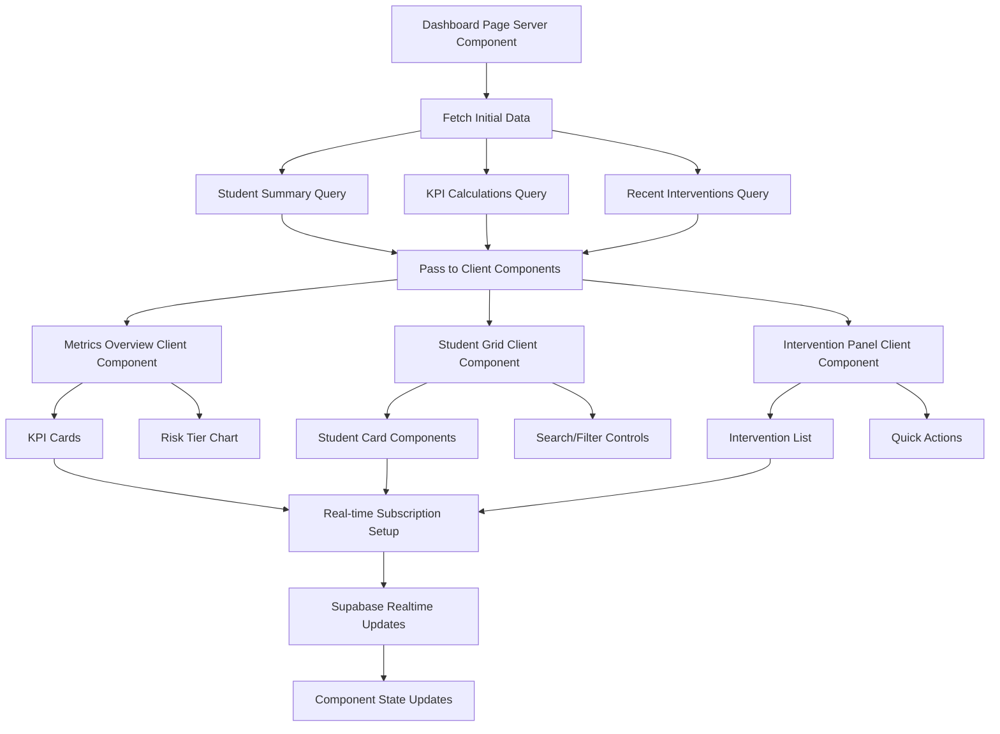
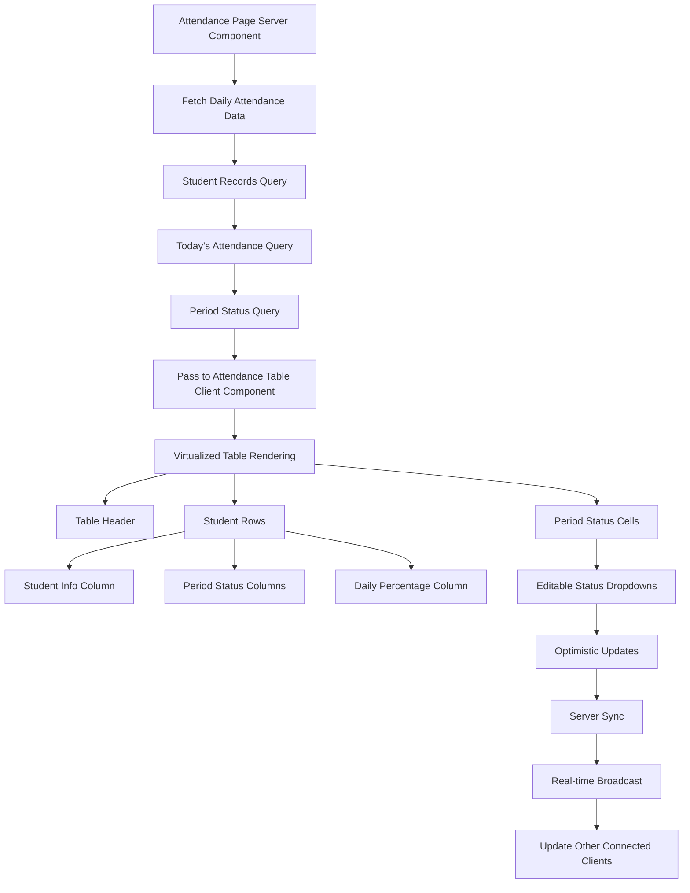

# AttendlyV1 Component Architecture

## Overview

This document defines the component hierarchy and architecture for AttendlyV1's Dashboard and Attendance pages, following Clean Architecture principles with React Server Components and client-side interactivity patterns.

## 1. Application Architecture Layers

### 1.1 Layer Structure

```
┌─────────────────────────────────────────┐
│            Presentation Layer           │
├─────────────────────────────────────────┤
│     Server Components (RSC)             │
│  ┌─────────────────────────────────────┐ │
│  │        Client Components           │ │
│  │     (Interactive UI Elements)     │ │
│  └─────────────────────────────────────┘ │
├─────────────────────────────────────────┤
│           Application Layer             │
│      (Use Cases & Services)             │
├─────────────────────────────────────────┤
│             Domain Layer                │
│     (Entities & Business Logic)         │
├─────────────────────────────────────────┤
│          Infrastructure Layer           │
│   (Supabase, External APIs, CSV)       │
└─────────────────────────────────────────┘
```

### 1.2 Component Communication Pattern

```typescript
// Server Component -> Client Component Data Flow
interface ComponentDataFlow {
  // Server Components (fetch data, no interactivity)
  serverComponents: {
    fetchInitialData(): Promise<PageData>;
    generateStaticMarkup(): JSX.Element;
    optimizeForSEO(): MetaData;
  };
  
  // Client Components (interactivity, state management)
  clientComponents: {
    handleUserInteractions(): void;
    manageLocalState(): StateUpdates;
    subscribeToRealtimeUpdates(): Subscription;
  };
  
  // Shared Types & Interfaces
  dataContracts: {
    StudentData: StudentSummary[];
    AttendanceMetrics: KPIData;
    InterventionStatus: InterventionSummary[];
  };
}
```

## 2. Dashboard Page Architecture

### 2.1 Dashboard Component Hierarchy

```
📁 app/dashboard/
├── 📄 page.tsx (Server Component - Root)
├── 📄 loading.tsx (Loading UI)
├── 📄 error.tsx (Error Boundary)
└── 📁 components/
    ├── 📄 dashboard-layout.tsx (Server Component)
    ├── 📄 metrics-overview.client.tsx (Client Component)
    ├── 📄 student-grid.client.tsx (Client Component)
    ├── 📄 intervention-panel.client.tsx (Client Component)
    └── 📁 widgets/
        ├── 📄 attendance-kpi-card.client.tsx
        ├── 📄 risk-tier-chart.client.tsx
        ├── 📄 iready-correlation-chart.client.tsx
        └── 📄 recent-interventions.client.tsx
```

### 2.2 Dashboard Data Flow



### 2.3 Dashboard Server Component Structure

```typescript
// app/dashboard/page.tsx (Server Component)
import { Suspense } from 'react';
import { createServerClient } from '@/lib/supabase/server';
import { DashboardLayout } from './components/dashboard-layout';
import { MetricsOverview } from './components/metrics-overview.client';
import { StudentGrid } from './components/student-grid.client';
import { InterventionPanel } from './components/intervention-panel.client';

interface DashboardPageProps {
  searchParams: {
    grade?: string;
    riskTier?: string;
    search?: string;
  };
}

export default async function DashboardPage({ searchParams }: DashboardPageProps) {
  const supabase = createServerClient();
  
  // Fetch initial data server-side for optimal performance
  const [
    studentSummaries,
    kpiMetrics,
    recentInterventions
  ] = await Promise.all([
    fetchStudentSummaries(supabase, searchParams),
    calculateKPIMetrics(supabase, searchParams),
    fetchRecentInterventions(supabase)
  ]);

  return (
    <DashboardLayout>
      <div className="grid grid-cols-1 lg:grid-cols-4 gap-6">
        {/* KPI Metrics Section */}
        <div className="lg:col-span-4">
          <Suspense fallback={<MetricsLoadingSkeleton />}>
            <MetricsOverview 
              initialData={kpiMetrics}
              filters={searchParams}
            />
          </Suspense>
        </div>
        
        {/* Student Grid Section */}
        <div className="lg:col-span-3">
          <Suspense fallback={<StudentGridSkeleton />}>
            <StudentGrid 
              initialStudents={studentSummaries}
              filters={searchParams}
            />
          </Suspense>
        </div>
        
        {/* Intervention Panel Section */}
        <div className="lg:col-span-1">
          <Suspense fallback={<InterventionPanelSkeleton />}>
            <InterventionPanel 
              initialInterventions={recentInterventions}
            />
          </Suspense>
        </div>
      </div>
    </DashboardLayout>
  );
}

// Server-side data fetching functions
async function fetchStudentSummaries(
  supabase: SupabaseClient,
  filters: DashboardPageProps['searchParams']
): Promise<StudentSummary[]> {
  let query = supabase
    .from('student_summary')
    .select('*')
    .order('last_name', { ascending: true });

  if (filters.grade) {
    query = query.eq('grade_level', parseInt(filters.grade));
  }
  
  if (filters.riskTier) {
    query = query.eq('risk_tier', filters.riskTier);
  }
  
  if (filters.search) {
    query = query.or(`first_name.ilike.%${filters.search}%,last_name.ilike.%${filters.search}%`);
  }

  const { data, error } = await query;
  
  if (error) {
    throw new Error(`Failed to fetch student summaries: ${error.message}`);
  }
  
  return data || [];
}
```

### 2.4 Client Component Implementation

```typescript
// components/student-grid.client.tsx (Client Component)
'use client';

import { useState, useEffect } from 'react';
import { createClientComponentClient } from '@/lib/supabase/client';
import { useJotai } from 'jotai';
import { studentFiltersAtom, selectedStudentAtom } from '@/store/dashboard-atoms';
import { StudentCard } from './student-card';
import { StudentSidePanel } from './student-side-panel';

interface StudentGridProps {
  initialStudents: StudentSummary[];
  filters: DashboardFilters;
}

export function StudentGrid({ initialStudents, filters }: StudentGridProps) {
  const [students, setStudents] = useState(initialStudents);
  const [loading, setLoading] = useState(false);
  const [selectedStudent, setSelectedStudent] = useAtom(selectedStudentAtom);
  const [currentFilters, setCurrentFilters] = useAtom(studentFiltersAtom);
  
  const supabase = createClientComponentClient();

  // Real-time subscription for student updates
  useEffect(() => {
    const channel = supabase
      .channel('student-updates')
      .on(
        'postgres_changes',
        {
          event: '*',
          schema: 'public',
          table: 'attendance_records'
        },
        (payload) => {
          handleAttendanceUpdate(payload);
        }
      )
      .on(
        'postgres_changes',
        {
          event: '*',
          schema: 'public',
          table: 'interventions'
        },
        (payload) => {
          handleInterventionUpdate(payload);
        }
      )
      .subscribe();

    return () => {
      supabase.removeChannel(channel);
    };
  }, [supabase]);

  // Handle real-time attendance updates
  const handleAttendanceUpdate = (payload: RealtimePostgresChangesPayload<any>) => {
    setStudents(prevStudents => 
      prevStudents.map(student => {
        if (student.student_id === payload.new?.student_id) {
          return {
            ...student,
            attendance_percentage_30_days: calculateUpdatedAttendance(student, payload.new),
            risk_tier: calculateRiskTier(student, payload.new)
          };
        }
        return student;
      })
    );
  };

  // Optimistic updates for better UX
  const handleStudentSelect = (student: StudentSummary) => {
    setSelectedStudent(student);
    
    // Prefetch detailed data for selected student
    prefetchStudentDetails(student.id);
  };

  return (
    <div className="relative">
      {/* Search and Filter Controls */}
      <div className="mb-6 space-y-4">
        <SearchInput 
          value={currentFilters.search} 
          onChange={(value) => setCurrentFilters(prev => ({ ...prev, search: value }))}
        />
        <FilterControls 
          filters={currentFilters}
          onChange={setCurrentFilters}
        />
      </div>

      {/* Student Grid */}
      <div className="grid grid-cols-1 md:grid-cols-2 xl:grid-cols-3 gap-4">
        {students.map((student) => (
          <StudentCard
            key={student.id}
            student={student}
            onSelect={() => handleStudentSelect(student)}
            isSelected={selectedStudent?.id === student.id}
          />
        ))}
      </div>

      {/* Student Side Panel */}
      {selectedStudent && (
        <StudentSidePanel
          student={selectedStudent}
          onClose={() => setSelectedStudent(null)}
        />
      )}

      {/* Loading State */}
      {loading && <LoadingOverlay />}
    </div>
  );
}
```

## 3. Attendance Page Architecture

### 3.1 Attendance Page Component Hierarchy

```
📁 app/attendance/
├── 📄 page.tsx (Server Component - Root)
├── 📄 loading.tsx
├── 📄 error.tsx
└── 📁 components/
    ├── 📄 attendance-layout.tsx (Server Component)
    ├── 📄 attendance-table.client.tsx (Client Component)
    ├── 📄 bulk-actions-toolbar.client.tsx (Client Component)
    ├── 📄 student-detail-sidebar.client.tsx (Client Component)
    └── 📁 table-components/
        ├── 📄 attendance-row.client.tsx
        ├── 📄 period-status-cell.client.tsx
        ├── 📄 attendance-percentage-cell.tsx
        └── 📄 quick-edit-modal.client.tsx
```

### 3.2 Attendance Table Architecture



### 3.3 Attendance Table Implementation

```typescript
// components/attendance-table.client.tsx
'use client';

import { useState, useCallback, useMemo } from 'react';
import { FixedSizeList as List } from 'react-window';
import { createClientComponentClient } from '@/lib/supabase/client';
import { AttendanceRow } from './table-components/attendance-row.client';

interface AttendanceTableProps {
  initialAttendanceData: AttendanceRecord[];
  selectedDate: Date;
  gradeLevel?: number;
}

export function AttendanceTable({ 
  initialAttendanceData, 
  selectedDate, 
  gradeLevel 
}: AttendanceTableProps) {
  const [attendanceData, setAttendanceData] = useState(initialAttendanceData);
  const [selectedStudent, setSelectedStudent] = useState<string | null>(null);
  const [bulkEditMode, setBulkEditMode] = useState(false);
  const [selectedRows, setSelectedRows] = useState<Set<string>>(new Set());
  
  const supabase = createClientComponentClient();

  // Optimistic update handler for attendance changes
  const handleAttendanceChange = useCallback(async (
    studentId: string,
    period: number,
    newStatus: AttendanceStatus
  ) => {
    // Optimistic update
    setAttendanceData(prevData => 
      prevData.map(record => {
        if (record.student_id === studentId) {
          const updatedRecord = {
            ...record,
            [`period_${period}_status`]: newStatus
          };
          // Recalculate daily percentage
          updatedRecord.daily_attendance_percentage = calculateDailyPercentage(updatedRecord);
          return updatedRecord;
        }
        return record;
      })
    );

    try {
      // Sync with server
      const { error } = await supabase
        .from('attendance_records')
        .update({
          [`period_${period}_status`]: newStatus,
          updated_at: new Date().toISOString()
        })
        .eq('student_id', studentId)
        .eq('date', selectedDate.toISOString().split('T')[0]);

      if (error) {
        // Revert optimistic update on error
        setAttendanceData(initialAttendanceData);
        throw error;
      }
    } catch (error) {
      console.error('Failed to update attendance:', error);
      // Show error toast
    }
  }, [supabase, selectedDate, initialAttendanceData]);

  // Bulk operations handler
  const handleBulkAction = useCallback(async (
    action: BulkAction,
    period?: number,
    status?: AttendanceStatus
  ) => {
    const updates = Array.from(selectedRows).map(studentId => ({
      student_id: studentId,
      [`period_${period}_status`]: status,
      updated_at: new Date().toISOString()
    }));

    try {
      // Batch update
      const { error } = await supabase
        .from('attendance_records')
        .upsert(updates, { onConflict: 'student_id,date' });

      if (error) throw error;

      // Clear selections
      setSelectedRows(new Set());
      setBulkEditMode(false);
    } catch (error) {
      console.error('Bulk update failed:', error);
    }
  }, [selectedRows, supabase]);

  // Virtualized row renderer for performance
  const Row = useCallback(({ index, style }: { index: number; style: React.CSSProperties }) => {
    const record = attendanceData[index];
    
    return (
      <div style={style}>
        <AttendanceRow
          record={record}
          onStatusChange={handleAttendanceChange}
          onStudentSelect={setSelectedStudent}
          isSelected={selectedRows.has(record.student_id)}
          onSelectionChange={(selected) => {
            setSelectedRows(prev => {
              const newSet = new Set(prev);
              if (selected) {
                newSet.add(record.student_id);
              } else {
                newSet.delete(record.student_id);
              }
              return newSet;
            });
          }}
          bulkEditMode={bulkEditMode}
        />
      </div>
    );
  }, [attendanceData, handleAttendanceChange, selectedRows, bulkEditMode]);

  return (
    <div className="attendance-table-container">
      {/* Bulk Actions Toolbar */}
      {bulkEditMode && (
        <BulkActionsToolbar
          selectedCount={selectedRows.size}
          onBulkAction={handleBulkAction}
          onCancel={() => {
            setBulkEditMode(false);
            setSelectedRows(new Set());
          }}
        />
      )}

      {/* Table Header */}
      <div className="table-header sticky top-0 bg-white z-10">
        <div className="grid grid-cols-12 gap-2 p-4 border-b">
          <div className="col-span-1">
            <input
              type="checkbox"
              onChange={(e) => {
                if (e.target.checked) {
                  setSelectedRows(new Set(attendanceData.map(r => r.student_id)));
                } else {
                  setSelectedRows(new Set());
                }
              }}
            />
          </div>
          <div className="col-span-3 font-semibold">Student</div>
          {[1, 2, 3, 4, 5, 6, 7].map(period => (
            <div key={period} className="col-span-1 text-center font-semibold">
              P{period}
            </div>
          ))}
          <div className="col-span-1 text-center font-semibold">Daily %</div>
        </div>
      </div>

      {/* Virtualized Table Body */}
      <List
        height={600}
        itemCount={attendanceData.length}
        itemSize={60}
        className="attendance-table-body"
      >
        {Row}
      </List>

      {/* Student Detail Sidebar */}
      {selectedStudent && (
        <StudentDetailSidebar
          studentId={selectedStudent}
          onClose={() => setSelectedStudent(null)}
        />
      )}
    </div>
  );
}
```

## 4. Shared Component Library

### 4.1 UI Component Structure

```
📁 src/presentation/components/ui/
├── 📄 button.tsx (Base Button Component)
├── 📄 card.tsx (Card Container)
├── 📄 dialog.tsx (Modal Dialog)
├── 📄 input.tsx (Form Input)
├── 📄 select.tsx (Dropdown Select)
├── 📄 toast.tsx (Notification Toast)
├── 📄 skeleton.tsx (Loading Skeleton)
└── 📁 charts/
    ├── 📄 bar-chart.tsx
    ├── 📄 line-chart.tsx
    └── 📄 pie-chart.tsx
```

### 4.2 Business Component Structure

```
📁 src/presentation/components/business/
├── 📄 student-card.tsx (Student Information Card)
├── 📄 attendance-kpi-card.tsx (KPI Display Card)
├── 📄 intervention-form.tsx (Intervention Creation Form)
├── 📄 risk-tier-indicator.tsx (Risk Level Indicator)
├── 📄 grade-level-filter.tsx (Grade Level Filter)
└── 📄 csv-upload-dialog.tsx (CSV File Upload)
```

## 5. State Management Architecture

### 5.1 Jotai Atom Structure

```typescript
// store/dashboard-atoms.ts
import { atom } from 'jotai';

// Filter state atoms
export const studentFiltersAtom = atom<StudentFilters>({
  search: '',
  gradeLevel: null,
  riskTier: null,
  sortBy: 'lastName',
  sortOrder: 'asc'
});

export const dateRangeAtom = atom<DateRange>({
  start: new Date(),
  end: new Date()
});

// Selection state atoms
export const selectedStudentAtom = atom<StudentSummary | null>(null);
export const selectedStudentsAtom = atom<Set<string>>(new Set());

// UI state atoms
export const sidebarOpenAtom = atom<boolean>(false);
export const bulkEditModeAtom = atom<boolean>(false);

// Derived atoms for computed values
export const filteredStudentsAtom = atom((get) => {
  const filters = get(studentFiltersAtom);
  const students = get(studentsAtom);
  
  return applyFilters(students, filters);
});

export const dashboardMetricsAtom = atom((get) => {
  const students = get(filteredStudentsAtom);
  
  return calculateDashboardMetrics(students);
});
```

### 5.2 SWR Data Fetching Pattern

```typescript
// hooks/use-student-data.ts
import useSWR from 'swr';
import { createClientComponentClient } from '@/lib/supabase/client';

export function useStudentData(filters: StudentFilters) {
  const supabase = createClientComponentClient();
  
  const { data, error, mutate } = useSWR(
    ['students', filters],
    async ([, filters]) => {
      let query = supabase
        .from('student_summary')
        .select('*');
      
      // Apply filters
      if (filters.gradeLevel) {
        query = query.eq('grade_level', filters.gradeLevel);
      }
      
      if (filters.riskTier) {
        query = query.eq('risk_tier', filters.riskTier);
      }
      
      const { data, error } = await query;
      
      if (error) throw error;
      return data;
    },
    {
      revalidateOnFocus: false,
      revalidateOnReconnect: true,
      refreshInterval: 30000, // 30 seconds
    }
  );

  return {
    students: data || [],
    loading: !error && !data,
    error,
    mutate
  };
}
```

## 6. Performance Optimization Strategies

### 6.1 Component Performance

```typescript
// Performance optimization techniques
interface PerformanceOptimizations {
  // Memoization strategies
  memoization: {
    studentCards: 'React.memo with shallow comparison';
    expensiveCalculations: 'useMemo for KPI calculations';
    eventHandlers: 'useCallback for stable references';
  };
  
  // Virtualization for large lists
  virtualization: {
    studentGrid: 'react-window for 1000+ students';
    attendanceTable: 'FixedSizeList for daily attendance';
    interventionHistory: 'VariableSizeList for intervention logs';
  };
  
  // Code splitting
  codeSplitting: {
    pageLevel: 'Dynamic imports for route-based splitting';
    componentLevel: 'Lazy loading for heavy components';
    libraryLevel: 'Bundle analysis and tree shaking';
  };
  
  // Caching strategies
  caching: {
    serverComponents: 'Next.js built-in caching';
    clientData: 'SWR with stale-while-revalidate';
    staticAssets: 'CDN caching for images and fonts';
  };
}
```

### 6.2 Accessibility Implementation

```typescript
// Accessibility compliance implementation
interface AccessibilityFeatures {
  keyboardNavigation: {
    tableNavigation: 'Arrow keys for cell navigation';
    modalFocus: 'Focus trap in dialogs';
    skipLinks: 'Skip to main content';
  };
  
  screenReaderSupport: {
    ariaLabels: 'Descriptive labels for all interactive elements';
    liveRegions: 'Announce attendance updates';
    tableHeaders: 'Proper header associations';
  };
  
  visualAccessibility: {
    colorContrast: 'WCAG 2.1 AA compliance';
    focusIndicators: 'Visible focus rings';
    textScaling: 'Support up to 200% zoom';
  };
  
  interaction: {
    touchTargets: 'Minimum 44px touch targets';
    gestureAlternatives: 'Keyboard alternatives for gestures';
    timeouts: 'No automatic timeouts without warning';
  };
}
```

## 7. Testing Strategy

### 7.1 Component Testing Pyramid

```typescript
// Testing implementation structure
interface TestingStrategy {
  unitTests: {
    components: 'React Testing Library for component logic';
    hooks: 'Custom hook testing with renderHook';
    utilities: 'Jest for pure function testing';
  };
  
  integrationTests: {
    userFlows: 'Testing Library for user interaction flows';
    apiIntegration: 'MSW for API mocking';
    realtimeUpdates: 'Supabase test client';
  };
  
  e2eTests: {
    criticalPaths: 'Playwright for dashboard loading';
    attendanceEntry: 'End-to-end attendance marking flow';
    csvImport: 'File upload and processing validation';
  };
  
  visualTests: {
    componentLibrary: 'Storybook for component documentation';
    regressionTesting: 'Chromatic for visual diff testing';
    responsiveDesign: 'Multiple viewport testing';
  };
}
```

---

**Last Updated**: 2025-07-29  
**Version**: 1.0  
**Next Review**: 2025-09-01