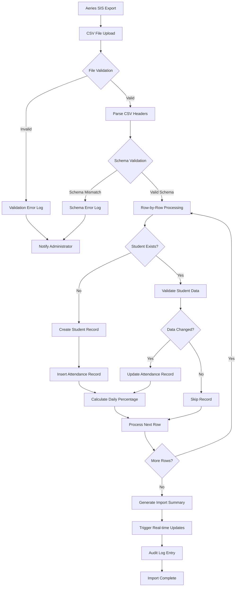
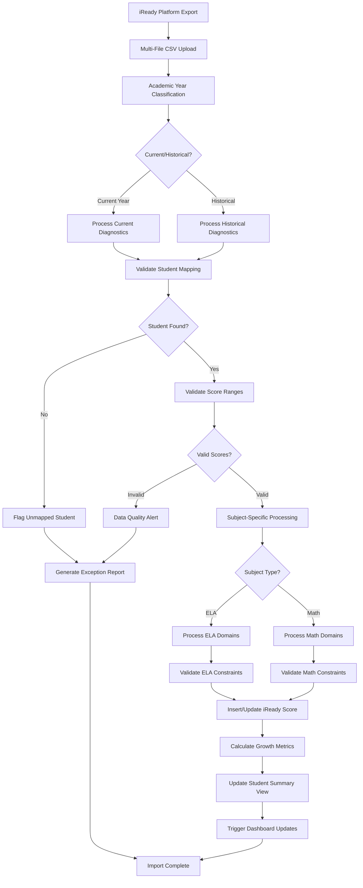
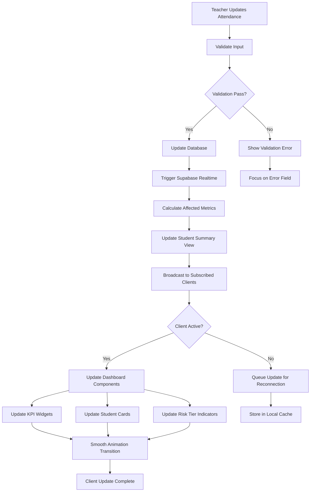
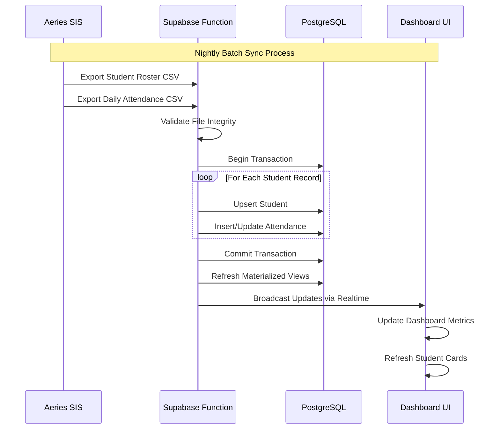
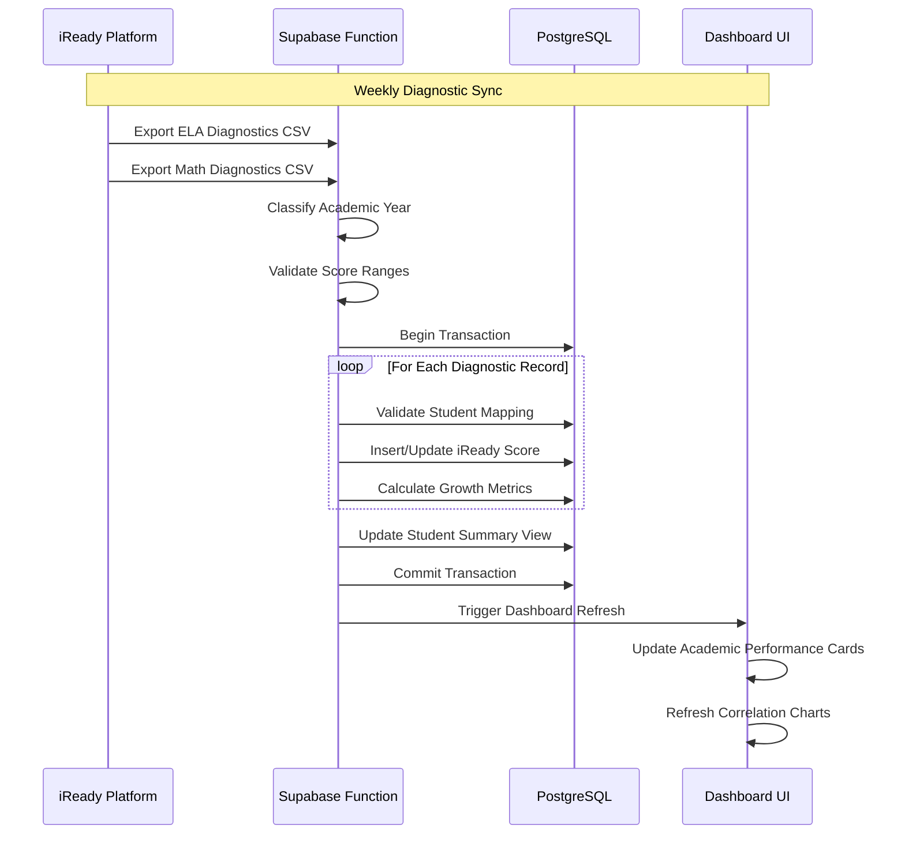
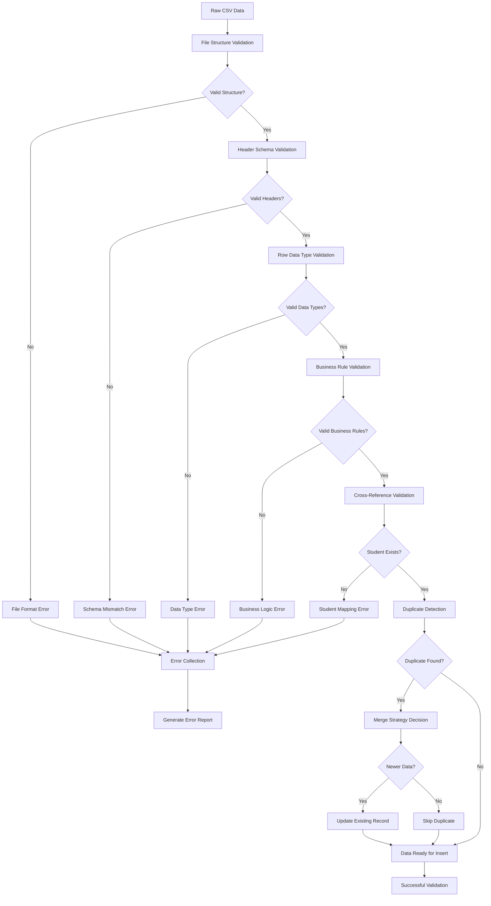
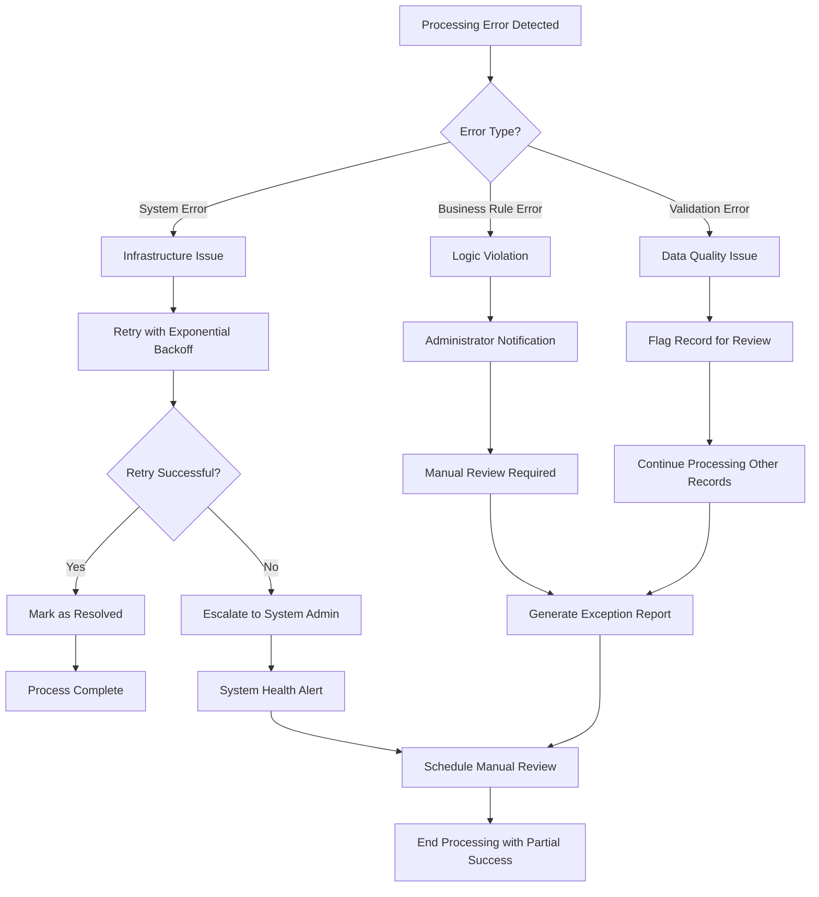
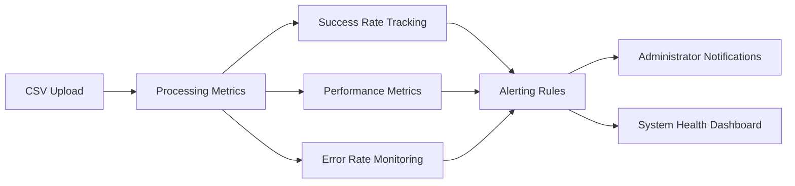

# AttendlyV1 Data Flow Architecture

## Overview

This document outlines the data flow patterns for AttendlyV1, covering CSV ingestion pipelines, real-time dashboard updates, and integration with external systems (Aeries SIS, iReady, A2A).

## 1. CSV Data Ingestion Pipeline

### 1.1 Attendance Data Import Flow



### 1.2 iReady Diagnostic Data Import Flow



### 1.3 CSV Processing Architecture

```typescript
// Edge Function for CSV Processing
interface CSVProcessor {
  // Validation Layer
  validateFileStructure(file: File): ValidationResult;
  validateRowData(row: CSVRow, schema: Schema): ValidationResult;
  
  // Processing Layer
  processAttendanceCSV(file: File): Promise<ProcessingResult>;
  processIReadyCSV(files: File[], academicYear: AcademicYear): Promise<ProcessingResult>;
  
  // Error Handling
  handleValidationErrors(errors: ValidationError[]): void;
  generateErrorReport(errors: ProcessingError[]): ErrorReport;
  
  // Audit Trail
  logImportActivity(
    userId: string, 
    fileType: string, 
    recordsProcessed: number,
    errors: ProcessingError[]
  ): Promise<void>;
}

interface ProcessingResult {
  success: boolean;
  recordsProcessed: number;
  recordsInserted: number;
  recordsUpdated: number;
  recordsSkipped: number;
  errors: ProcessingError[];
  summary: ImportSummary;
}
```

## 2. Real-time Dashboard Updates

### 2.1 Real-time Update Flow



### 2.2 Dashboard Subscription Architecture

```typescript
// Real-time Subscription Manager
interface DashboardSubscription {
  // Grade-level subscriptions for teachers
  subscribeToGradeLevel(gradeLevel: number, callback: UpdateCallback): Subscription;
  
  // School-wide subscriptions for administrators
  subscribeToSchoolWide(callback: UpdateCallback): Subscription;
  
  // Student-specific subscriptions
  subscribeToStudent(studentId: string, callback: UpdateCallback): Subscription;
  
  // Intervention updates
  subscribeToInterventions(callback: UpdateCallback): Subscription;
}

interface UpdateCallback {
  onAttendanceUpdate(update: AttendanceUpdate): void;
  onInterventionUpdate(update: InterventionUpdate): void;
  onStudentSummaryUpdate(update: StudentSummaryUpdate): void;
  onKPIUpdate(update: KPIUpdate): void;
}

// Supabase Realtime Configuration
const realtimeConfig = {
  channels: [
    {
      name: 'attendance_updates',
      table: 'attendance_records',
      filter: `grade_level=eq.${userGradeLevel}`,
      events: ['INSERT', 'UPDATE']
    },
    {
      name: 'intervention_updates',
      table: 'interventions',
      filter: `created_by=eq.${userEmployeeId}`,
      events: ['INSERT', 'UPDATE', 'DELETE']
    }
  ]
};
```

## 3. Integration Data Flow

### 3.1 Aeries SIS Integration



### 3.2 iReady Integration Flow



## 4. Data Validation Pipeline

### 4.1 Multi-Layer Validation Strategy



### 4.2 Validation Rules Configuration

```typescript
// Validation Schema Definitions
interface ValidationSchema {
  attendance: {
    required: ['student_id', 'date', 'period_1_status', /* ... */];
    types: {
      student_id: 'string',
      date: 'date',
      daily_attendance_percentage: 'number'
    };
    constraints: {
      date: { minDate: '2020-08-01', maxDate: 'current_date + 30' },
      grade_level: { min: 6, max: 8 },
      daily_attendance_percentage: { min: 0, max: 100 }
    };
  };
  
  iready: {
    required: ['student_id', 'subject', 'diagnostic_date', 'overall_scale_score'];
    types: {
      overall_scale_score: 'integer',
      academic_year: 'enum'
    };
    constraints: {
      overall_scale_score: { min: 100, max: 800 },
      subject: { enum: ['ELA', 'MATH'] }
    };
    conditionalRequirements: {
      ela: ['phonological_awareness_score', 'phonics_score', /* ... */],
      math: ['number_and_operations_score', 'algebra_and_algebraic_thinking_score', /* ... */]
    };
  };
}
```

## 5. Error Handling and Recovery

### 5.1 Error Classification and Recovery



### 5.2 Data Recovery Strategies

```typescript
// Error Recovery Service
interface DataRecoveryService {
  // Retry failed imports with intelligent backoff
  retryFailedImports(failedJobs: FailedJob[]): Promise<RecoveryResult>;
  
  // Recover from partial imports
  resumePartialImport(importId: string, lastProcessedRow: number): Promise<void>;
  
  // Data integrity verification
  verifyDataIntegrity(tableName: string, importBatch: string): Promise<IntegrityReport>;
  
  // Rollback capabilities for critical failures
  rollbackImport(importId: string): Promise<RollbackResult>;
}

interface RecoveryStrategy {
  maxRetries: number;
  backoffMultiplier: number;
  retryableErrors: ErrorCode[];
  escalationThreshold: number;
  notificationChannels: NotificationChannel[];
}
```

## 6. Performance Optimization

### 6.1 Batch Processing Strategy

- **Chunk Size**: Process CSV files in 1000-record batches
- **Parallel Processing**: Utilize multiple Edge Functions for concurrent processing
- **Memory Management**: Stream large files to prevent memory exhaustion
- **Progress Tracking**: Real-time progress updates for long-running imports

### 6.2 Caching Strategy

- **Student Summary Cache**: Redis cache for frequently accessed student data
- **Dashboard Metrics Cache**: 5-minute TTL for KPI calculations
- **Static Reference Data**: Long-term caching for grade levels, school calendar

### 6.3 Database Optimization

- **Materialized Views**: Pre-calculated aggregations for dashboard queries
- **Partitioning**: Attendance records partitioned by school year
- **Indexing Strategy**: Optimized indexes for common query patterns
- **Connection Pooling**: Efficient database connection management

## 7. Monitoring and Observability

### 7.1 Data Flow Monitoring



### 7.2 Key Performance Indicators

- **Import Success Rate**: Target >99% for routine imports
- **Processing Time**: <5 minutes for 1000-record attendance files
- **Real-time Latency**: <100ms for dashboard updates
- **Data Quality Score**: Automated scoring based on validation rules
- **System Availability**: 99.9% uptime target for dashboard access

---

**Last Updated**: 2025-07-29  
**Version**: 1.0  
**Next Review**: 2025-08-29